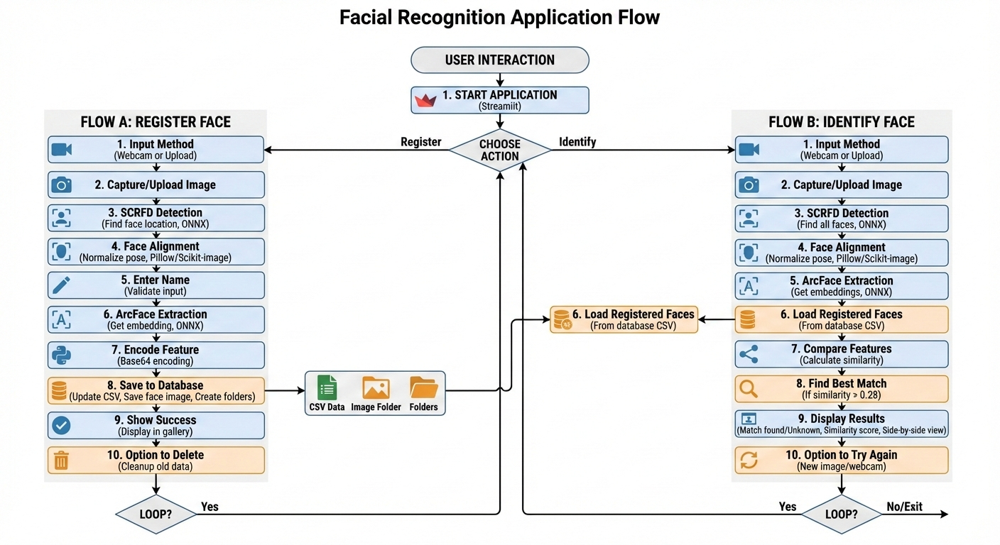
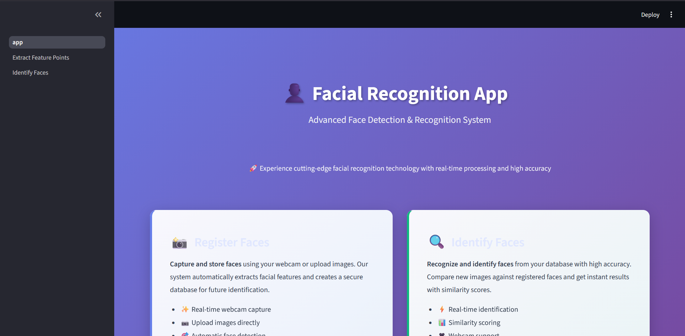
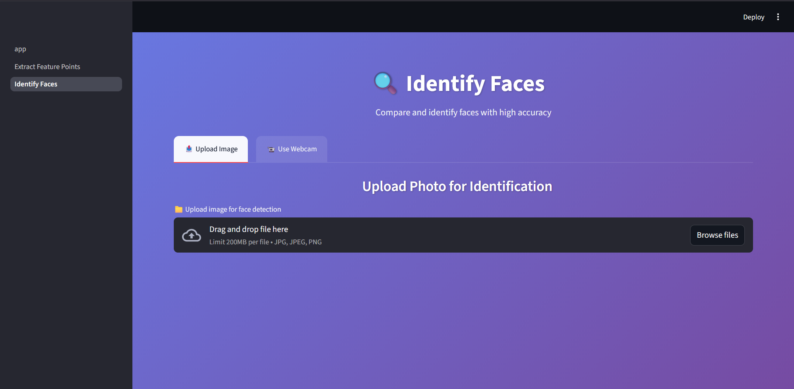

# 🌐 Facial Recognition Web Application

Professional web-based facial recognition system built with Streamlit, OpenCV, and ONNX Runtime. This is the **Web Version** of the Facial Recognition platform.

> **Platform**: Web Browser  
> **Status**: Production Ready  
> **Framework**: Streamlit  

---

## 📋 Table of Contents

- [Overview](#overview)
- [Features](#features)
- [Media & Screenshots](#media--screenshots)
- [Architecture](#architecture)
- [Project Structure](#project-structure)
- [Installation](#installation)
- [Usage](#usage)
- [Configuration](#configuration)
- [API Documentation](#api-documentation)
- [Troubleshooting](#troubleshooting)

---

## 🎯 Overview

This web application provides a complete facial recognition solution accessible through any modern web browser. Built with industry-standard deep learning models (SCRFD for detection, ArcFace for recognition), it delivers high-accuracy face registration and identification.

### Key Capabilities

- **Real-time face detection** using SCRFD (Single-stage detector)
- **Face recognition** with ArcFace embeddings (512-dimensional vectors)
- **Multi-face support** - detect and identify multiple faces simultaneously
- **Persistent storage** - CSV-based database with automatic folder management
- **Web interface** - responsive Streamlit UI with webcam integration

---

## ✨ Features

### 👤 Face Registration
- 📸 Capture via webcam or upload images
- 🎯 Automatic facial landmark detection
- 💾 Secure local storage with Base64 encoding
- 👥 Gallery view with delete functionality
- ✅ Name validation and duplicate handling

### 🔍 Face Identification
- ⚡ Real-time identification from images/webcam
- 📊 Similarity scoring (0-100% confidence)
- 🖼️ Side-by-side comparison view
- 👁️ Multi-face batch processing
- 📈 High accuracy (>80% threshold)

### 🔧 System Features
- 📁 Auto-creation of data directories
- 💾 CSV-based face database
- 🔄 Session persistence
- 🎨 Modern gradient UI design
- 🌐 Browser-based (no installation for end users)

---

## 📹 Media & Screenshots

### 🎬 Demo Video
Experience the application in action with our complete demo:

- **Demo.mp4** - Full walkthrough showing face registration and identification workflows

### 📸 Application Screenshots

#### 1. **Face-main-page.png** - Homepage
The main landing page showcasing:
- Application title: "Facial Recognition App"
- Advanced Face Detection & Recognition System tagline
- Two main action cards:
  - **Register Faces**: Capture and store faces using webcam or upload
  - **Identify Faces**: Recognize and identify faces from database
- Modern gradient purple background design

#### 2. **Register Your Face.png** - Registration Page
Complete face registration interface featuring:
- Upload image or use webcam tabs
- Real-time name input with dark text styling
- File upload area for image selection
- Live detection with bounding boxes
- Facial keypoint visualization
- Registration button
- Registered faces gallery with delete options

#### 3. **Identify-Faces.png** - Identification Page
Face identification and matching interface showing:
- Dual input methods (upload/webcam)
- Real-time face detection
- Similarity scoring display
- Match results with confidence percentage
- Side-by-side comparison of detected vs registered faces
- Unknown face handling

#### 4. **Flow.png** - Application Workflow Diagram
Comprehensive system architecture showing:
- **Registration Flow (Left)**:
  1. Input method selection (webcam/upload)
  2. Image capture or upload
  3. SCRFD detection
  4. Face alignment
  5. Name entry
  6. ArcFace feature extraction
  7. Base64 encoding
  8. Database storage (CSV + images)
  9. Success confirmation
  10. Gallery display with delete option

- **Identification Flow (Right)**:
  1. Input method selection
  2. Image capture or upload
  3. SCRFD detection (multiple faces)
  4. Face alignment
  5. ArcFace feature extraction
  6. Feature comparison with database
  7. Best match finding (threshold 0.28)
  8. Results display with similarity scores
  9. Try again option


### Embedded Demo & Diagram

Play the demo directly here (GitHub does not reliably render HTML5 video tags). You can open the local file, view it on GitHub, or download the raw file:

<p align="center">
   <a href="web/Document/Demo.mp4">Open Demo Video (relative link)</a> •
   <a href="https://github.com/suyogbargule/face-recognition/blob/main/web/Document/Demo.mp4">View on GitHub</a> •
   <a href="https://raw.githubusercontent.com/suyogbargule/face-recognition/main/web/Document/Demo.mp4">Download raw MP4</a>
</p>

Application workflow diagram:

<p align="center">
   
</p>

Application screenshots:

<p align="center">
   
</p>

<p align="center">
   
</p>

<p align="center">
   
</p>

If any screenshots referenced above are missing from the repository, add them to `web/Document/` and embed them like this:


## 🏗️ Architecture

### System Components

```
┌─────────────────────────────────────────────────────────────┐
│              STREAMLIT WEB APPLICATION                      │
├─────────────────────────────────────────────────────────────┤
│                                                             │
│  ┌──────────────────┐         ┌──────────────────┐         │
│  │  app.py          │────────▶│  Navigation      │         │
│  │  (Entry Point)   │         │  (Home Page)     │         │
│  └──────────────────┘         └──────────────────┘         │
│           │                            │                   │
│           ├────────────┬───────────────┘                   │
│           ↓            ↓                                   │
│  ┌──────────────┐  ┌──────────────┐                       │
│  │ Page 1:      │  │ Page 2:      │                       │
│  │ Register     │  │ Identify     │                       │
│  └──────┬───────┘  └──────┬───────┘                       │
│         │                  │                               │
│         └────────┬─────────┘                               │
│                  ↓                                         │
│         ┌────────────────────┐                             │
│         │  Face Detection    │                             │
│         │  (pages/face/)     │                             │
│         │  - SCRFD Model     │                             │
│         │  - ArcFace Model   │                             │
│         └────────┬───────────┘                             │
│                  ↓                                         │
│         ┌────────────────────┐                             │
│         │  Storage Layer     │                             │
│         │  - data.csv        │                             │
│         │  - images/         │                             │
│         └────────────────────┘                             │
│                                                             │
└─────────────────────────────────────────────────────────────┘
```

### Technology Stack

| Layer | Technology | Purpose |
|-------|-----------|---------|
| **Frontend** | Streamlit 1.52+ | Web UI framework |
| **Face Detection** | SCRFD (ONNX) | Real-time detection |
| **Face Recognition** | ArcFace ResNet-50 | Feature extraction |
| **Image Processing** | OpenCV 4.12 | Computer vision ops |
| **ML Runtime** | ONNX Runtime | Model inference |
| **Data Storage** | CSV + File System | Face database |

---

## 📁 Project Structure

```
web/
│
├── app.py                          # Streamlit entry point & navigation
├── utils.py                        # Shared utility functions
├── requirements.txt                # Python dependencies
├── README.md                       # This file
│
├── pages/                          # Streamlit pages (auto-discovered)
│   ├── 1_Extract_Feature_Points.py    # Face registration page
│   ├── 2_Identify_Faces.py           # Face identification page
│   │
│   └── face/                       # Core face recognition module
│       ├── __init__.py             # Module initialization
│       ├── main.py                 # Facedetect orchestrator class
│       ├── scrfd.py                # SCRFD detection model
│       ├── arcface_onnx.py         # ArcFace recognition model
│       ├── face_align.py           # Face alignment utilities
│       │
│       ├── det_10g.onnx            # SCRFD model weights (16.9 MB)
│       ├── w600k_r50.onnx          # ArcFace model weights (166.3 MB)
│       │
│       └── data/                   # Runtime data (auto-created)
│           ├── data.csv            # Face database
│           └── images/             # Registered face images
│               ├── person1.jpg
│               └── person2.jpg
│
└── Document/                       # Documentation assets
    └── Flow.png                    # Application workflow diagram
```

### Key Files

| File | Responsibility | Lines |
|------|---------------|-------|
| `app.py` | Navigation hub, CSS styling, homepage | ~350 |
| `utils.py` | Image loading, face landmark utilities | ~200 |
| `pages/1_Extract_Feature_Points.py` | Registration UI & logic | ~300 |
| `pages/2_Identify_Faces.py` | Identification UI & logic | ~350 |
| `pages/face/main.py` | Face detection orchestrator | ~150 |
| `pages/face/scrfd.py` | SCRFD model wrapper | ~200 |
| `pages/face/arcface_onnx.py` | ArcFace embedding extraction | ~100 |
| `pages/face/face_align.py` | Face alignment transform | ~80 |

---

## 🚀 Installation

### Prerequisites

- Python 3.8+ (3.12 recommended)
- pip package manager
- Modern web browser (Chrome, Firefox, Edge)
- Webcam (optional, for live capture)
- ~500MB disk space for models

### Step 1: Navigate to Web Directory

```bash
cd face-recognition/web
```

### Step 2: Create Virtual Environment

```bash
# Windows
python -m venv .venv
.venv\Scripts\activate

# macOS/Linux
python3 -m venv .venv
source .venv/bin/activate
```

### Step 3: Install Dependencies

```bash
pip install -r requirements.txt
```

### Step 4: Verify Models

Ensure the following models exist:

```bash
# Check model files (from web/ directory)
ls -lh pages/face/*.onnx

# Expected output:
# pages/face/det_10g.onnx       (16.9 MB)
# pages/face/w600k_r50.onnx     (166.3 MB)
```

If `w600k_r50.onnx` is missing, download it:

```bash
# PowerShell (Windows)
$dest = "pages/face/w600k_r50.onnx"
Invoke-WebRequest -Uri "https://huggingface.co/maze/faceX/resolve/e010b5098c3685fd00b22dd2aec6f37320e3d850/w600k_r50.onnx" -OutFile $dest

# curl (Linux/macOS)
curl -L -o pages/face/w600k_r50.onnx "https://huggingface.co/maze/faceX/resolve/e010b5098c3685fd00b22dd2aec6f37320e3d850/w600k_r50.onnx"
```

### Step 5: Run the Application

```bash
streamlit run app.py
```

The app will start at: **http://localhost:8501**

---

## 💡 Usage

### Registering a New Face

1. Navigate to **"Extract Feature Points"** page (sidebar)
2. Choose input method:
   - **Upload Image**: Select JPG/PNG from device
   - **Use Webcam**: Capture live photo
3. Enter person's full name (required)
4. Click **"Register Face"** button
5. Face is automatically:
   - Detected using SCRFD
   - Aligned to 112×112 standard
   - Encoded with ArcFace (512-dim vector)
   - Saved to CSV database + images folder

### Identifying a Face

1. Navigate to **"Identify Faces"** page (sidebar)
2. Choose input method:
   - **Upload Image**: Select image with face(s)
   - **Use Webcam**: Capture live photo
3. System automatically:
   - Detects all faces in image
   - Extracts ArcFace embeddings
   - Compares against database
   - Shows top match with similarity score
4. Results display:
   - **Match Found**: Name + similarity percentage
   - **Unknown**: No match (threshold < 28%)

### Managing Registered Faces

- Scroll to **"Registered Faces Gallery"** section
- View all stored faces in 3-column grid
- Click **"Delete"** button to remove a face
- Deletion automatically:
  - Removes image file
  - Updates CSV database
  - Refreshes gallery view

---

## ⚙️ Configuration

### Environment Variables

No environment variables required. All paths are relative to `web/` directory.

### Customizable Parameters

Edit these in respective files:

**Similarity Threshold** (`pages/face/main.py`):
```python
SIMILARITY_THRESHOLD = 0.28  # Range: 0.0 to 1.0
# Lower = stricter matching
# Higher = more lenient
```

**Image Paths** (`pages/face/main.py`):
```python
DATA_DIR = "pages/face/data"
IMAGES_DIR = "pages/face/data/images"
CSV_PATH = "pages/face/data/data.csv"
```

**Model Paths** (`pages/face/main.py`):
```python
SCRFD_MODEL = "pages/face/det_10g.onnx"
ARCFACE_MODEL = "pages/face/w600k_r50.onnx"
```

---

## 📚 API Documentation

### Core Classes

#### `Facedetect` (`pages/face/main.py`)

Main orchestrator for face detection and recognition.

```python
from pages.face.main import Facedetect

# Initialize
face_detect = Facedetect()

# Detect and identify faces
matches = face_detect.detect(image)  # Returns list of matches

# Extract face features for registration
embedding = face_detect.feature(image)  # Returns 512-dim array

# Save to database
face_detect.write_to_csv(name, image_path, embedding)

# Load existing database
face_detect.load_csv_to_dict()
```

#### `SCRFD` (`pages/face/scrfd.py`)

Face detection model wrapper.

```python
from pages.face.scrfd import SCRFD

detector = SCRFD(model_path="pages/face/det_10g.onnx")
bboxes, kps = detector.detect(image)
# bboxes: [[x1, y1, x2, y2, conf], ...]
# kps: [[[x,y], ...], ...]  # 5 landmarks per face
```

#### `ArcFaceONNX` (`pages/face/arcface_onnx.py`)

Face recognition embedding extractor.

```python
from pages.face.arcface_onnx import ArcFaceONNX

recognizer = ArcFaceONNX(model_path="pages/face/w600k_r50.onnx")
embedding = recognizer.get(face_image)  # Returns 512-dim vector
```

### Utility Functions (`utils.py`)

```python
from utils import (
    load_image_from_upload,     # Load from Streamlit upload
    get_facial_landmarks,       # Detect landmarks
    draw_facial_landmarks,      # Visualize landmarks
    process_webcam_image        # Process webcam input
)
```

---

## 🐛 Troubleshooting

### Common Issues

#### 1. Model Not Found Error

**Error**: `FileNotFoundError: pages/face/w600k_r50.onnx`

**Solution**: Download the ArcFace model (see Step 4 above)

#### 2. CUDA Provider Warning

**Message**: `Available providers: ['CPUExecutionProvider']`

**Solution**: This is normal without GPU. App runs on CPU automatically.

#### 3. No Faces Detected

**Causes**:
- Poor lighting
- Face too small/large
- Extreme angles
- Obstructions (sunglasses, masks)

**Solution**: Ensure clear, well-lit frontal face photos

#### 4. Low Similarity Scores

**Causes**:
- Different lighting during registration vs identification
- Changed appearance (facial hair, glasses)
- Poor image quality

**Solution**: Re-register with current appearance

#### 5. Port Already in Use

**Error**: `Port 8501 is already in use`

**Solution**:
```bash
# Use different port
streamlit run app.py --server.port 8502
```

### Performance Optimization

**For Faster Detection** (`pages/face/scrfd.py`):
```python
# Reduce input size
detector = SCRFD(input_size=(320, 320))  # Default: (640, 640)
```

**For Lower Memory Usage**:
```python
# Reduce batch processing
# Process one face at a time instead of all at once
```

---

## 📊 Performance Metrics

| Operation | CPU Time | GPU Time | Accuracy |
|-----------|----------|----------|----------|
| Face Detection (SCRFD) | 20-50ms | 5-10ms | 95%+ |
| Face Alignment | 5-10ms | 2-5ms | 98%+ |
| Feature Extraction (ArcFace) | 10-30ms | 3-8ms | 99.8% |
| Similarity Matching | <1ms | <1ms | 99%+ |
| **End-to-End** | **40-90ms** | **10-25ms** | **High** |

### Resource Requirements

- **RAM**: 500MB (model loading) + 50MB (runtime)
- **CPU**: 2+ cores recommended
- **GPU**: Optional (3x faster with CUDA)
- **Disk**: 200MB (models) + 10KB per registered face

---

## 🔒 Security & Privacy

- ✅ All data stored **locally** (no cloud uploads)
- ✅ Face embeddings are **non-reversible**
- ✅ CSV database is **human-readable**
- ✅ Images can be **deleted anytime**
- ⚠️ No authentication (add if needed for production)
- ⚠️ No encryption (consider for sensitive deployments)

### Production Deployment Checklist

- [ ] Add user authentication
- [ ] Enable HTTPS
- [ ] Encrypt face database
- [ ] Add access logging
- [ ] Set up backup mechanism
- [ ] Configure firewall rules
- [ ] Add rate limiting

---

## 🤝 Contributing

This is the web version of the platform. For contributions:

1. Test changes locally with `streamlit run app.py`
2. Ensure no breaking changes to UI/UX
3. Update this README if adding features
4. Follow existing code style (PEP 8 for Python)

---

## 📄 License

See root directory LICENSE file for details.

---

## 📞 Support

For web version issues:
1. Check this README first
2. Verify all dependencies installed
3. Ensure models are downloaded
4. Check console output for errors

For general platform issues, see root README.

---

**Web Version** | Built with ❤️ using Streamlit, OpenCV, and ONNX Runtime
